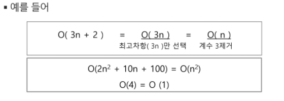
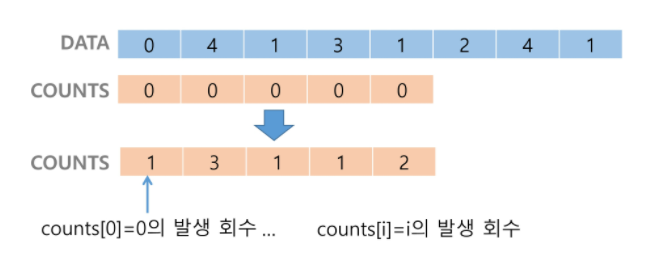
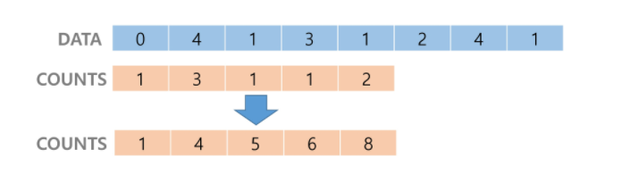
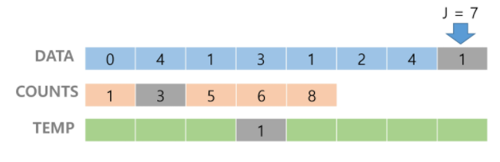
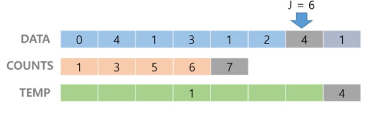
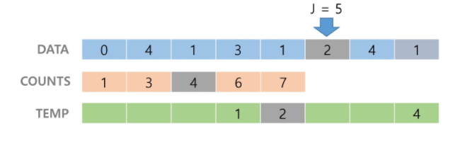
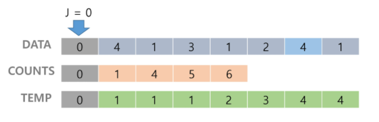
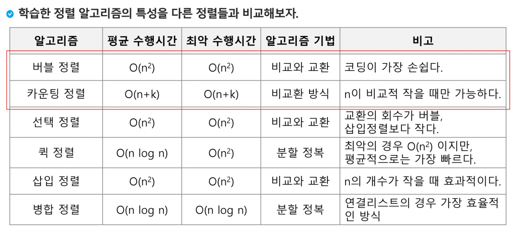

## 0209 라이브

# 알고리즘

- 알고리즘 : 유한한 단계를 통해 문제를 해결하기 위한 절차나 방법
- 컴퓨터 분야에서 알고리즘을 표현 하는 방법은 크게 두가지
  - 슈도 코드와 순서도
- 무엇이 좋은 알고리즘인가?
  - 정확성 : 얼마나 정확하게 작동하는가
  - 작업량 : 얼마나 적은 연산으로 원하는 결과를 얻어내는가
  - 메모리 사용량 : 얼마나 적은 메모리를 사용하는가
  - 단순성 : 얼마나 단순한가
  - 최적성 : 더 이상 개선할 여지없이 최적화되었는가

- 알고리즘의 성능은 무엇으로 측정하는가

  - 작업량으로 판단
  - 작업량은 시간복잡도로 표현
    - 실제 걸리는 시간을 측정
    - 실행되는 명령문의 개수를 계산
  - 빅-오 표기법
    - 시간 복잡도 함수 중에서 가장 큰 영향력을 주는 n에 대한 항만을 표시
    - 계수는 생략
    - 

- 배열이란 무엇인가

  - 일정한 자료형의 변수들을 하나의 이름으로 열거하여 사용하는 자료구조

  - 1차원 배열의 선언

    - 별도의 선언 방법이 없으면 변수에 처음 값을 할당할 때 생성
    - 이름: 프로그램에서 사용할 배열의 이름

  - ```python
    Arr = list()
    Arr = []
    Arr = [1,2,3]
    Arr = [0]*10
    ```

  - 1차원 배열의 접근

    - ```python
      Arr[0] = 10 // '배열 Arr의 0번 원소에 10을 저장하라'
      Arr[idx] = 20 // '배열 Arr의 idx번 원소에 20을 저장하라'
      ```

- 정렬

  - 2개 이상의 자료를 특정 기준에 의해 작은 값부터 큰 (오름차순 : ascending)값, 혹은 그 반대의 순서대로(내림차순 : descending) 재배열 하는 것

  - 정렬의 종류

    - 버블 정렬

      - 인접한 두 개의 원소를 비교하며 자리를 계속 교환하는 방식

      - 정렬 과정

        - 첫 번째 원소부터 인접한 원소끼리 계속 자리를 교환하면서 맨 마지막 자리까지 이동한다.
        - 한 단계가 끝나면 가장 큰 원소가 마지막 자리로 정렬된다.
        - 교환하며 자리를 이동하는 모습이 물 위로 올라오는 거품 모양과 같아고 하여 버블정렬이라고 한다.
        - O(n^2)

      - ```python
        def BubbleSort(a, N) :
            for i in range(n-1, 0, -1) :
                for j in range(0, i) :
                    if a[j] > a[j+1] :
                        a[j], a[j+1] = a[j+1], a[j]
        ```

      - 

    - 카운팅 정렬

      - 항목들의 순서를 결정하기 위해 집합에 각 항목이 몇 개씩 있는지 세는 작업을 하여, 선형 시간에 정렬하는 효율적인 알고리즘

      - 제한 사항

        - 정수나 정수로 표현할 수 있는 자료에 대해서만 적용 가능 : 각 항목의 발생 회수를 기록하기 위해, 정수 항목으로 인덱스 되는 카운트들의 배열을 사용하기 때문
        - 카운트들을 위한 충분한 공간을 할당하려면 집합 내의 큰 정수를 알아야 한다.
        - O(n+k)

      - 1단계

        - Data에서 각 항목들의 발생 회수를 세고, 정수 항목들로 직접 인덱스되는 카운트 배열 counts에 저장한다.

        - 

        - 정렬된 집합에서 각 항목의 앞에 위치할 항목의 개수를 반영하기 위해 counts의 원소를 조정한다.

        - 

        - counts[1]을 감소시키고 Temp에 1을 삽입한다.

        - 

        - counts[4]를 감소시키고 Temp에 4를 삽입한다.

        - 

        - counts[2]를 감소시키고 Temp에 2를 삽입한다.

        - 

        - 반복...

        - counts[0]을 감소시키고 Temp에 0을 삽입한다.

        - 

        - Temp 업데이트 완료하고 정렬 작업을 종료한다.

        - ```python
          def Counting_sort(A, B, k)
          '''
          A [] -- 입력배열 (1 to k)
          B [] -- 정렬된 배열.
          C [] -- 카운트 배열.
          '''
          
          	C = [0] * (k+1)
              
              for i in range (0, len(A)) :
                  C[A[i]] += 1
              
              for i in range (1, len(C)) :
                  C[i] += C[i-1]
                  
              for i in range (len(B)-1, -1, -1) :
                  C[A[i]] -= 1
                  B[C[A[i]]] = A[i]
          ```

        - 

    - 선택 정렬

    - 퀵 정렬

    - 삽입 정렬

    - 병합 정렬

    - 

  - Baby-Gin 문제

    - 0~9사이의 숫자 카드에서 임의의 카드 6장을 뽑았을 때

    - 3장의 카드가 연속적인 번호를 갖는 경우 run

    - 3장의 카드가 동일한 번호를 갖는 경우 triplet

    - 6장의 카드가 run과 triplet으로만 구성된 경우 baby-gin

    - baby-gin 여부 판별

    - 완전 검색 활용

      - 고려할 수 있는 모든 경우의수 생성하기

    - ### 순열 (Permutation)

      - 서로 다른 것들 중 몇 개를 뽑아서 한 줄로 나열하는 것

      - 서로 다른 n개 중 r개를 택하는 순열은 아래와 같이 표현한다.

      - nPr

      - 그리고 nPr은 다음과 같은 식이 성립한다.

      - nPr = n * (n-1) * (n-2) * ... * (n-r+1)

      - nPn = n!라고 표기하며 Factorial이라 부른다.

      - n! = n * (n-1) * (n-2) * ... * 2 * 1

      - ex) {1,2,3}을 포함하는 모든 순열을 생성하는 함수

        - 동일한 숫자가 포함되지 않았을 때, 각 자리수 별로 loop을 이용해 아래와 같이 구현할 수 있다.

        - ```python
          for i1 in range(1,4):
              for i2 in range(1,4):
                  if i2 != i1:
                      for i3 in range(1,4):
                          if i3 != i1 and i3 != i2:
                              print(i1, i2, i3)
          ```

  - 탐욕(Greedy) 알고리즘

    - 탐욕 알고리즘은 최적해를 구하는 데 사용되는 근시안적인 방법

    - 여러 경우 중 하나를 결정해야 할 때마다 그 순간에 최적이라고 생각되는 것을 선택해 나가는 방식으로 진행하여 최종적인 해답에 도달한다.

    - 각 선택의 시점에서 이루어지는 결정은 지역적으로는 최적이지만, 그 선택들은 계속 수집하여 최종적인 해답을 만들었다고 하여, 그것이 최적이라는 보장은 없다.

    - 일반적으로, 머릿속에 떠오르는 생각을 검증없이 바로 구현하면 Greedy 접근

      1. 해 선택 : 현재 상태에서 부분 문제의 최적 해를 구한 뒤, 이를 부분해 집합에 추가
      2.  실행 가능성 검사 : 새로운 부분해 집합이 실행 가능한지를 확인, 문제의 제약 조건을 위반하지 않는지 검사
      3. 해 검사 : 새로운 부분해 집합이 문제의 해가 되는지를 확인, 아직 전체 문제의 해가 완성되지 않았다면 해 선택부터 재시작

    - ```python
      num = 456789
      c = [0] * 12
      
      for i in range(6):
          c[num % 10] += 1
          num //= 10
      
      i = 0
      tri = run = 0
      while i < 10 :
          if c[i] >= 3
          c[i] -= 3
          tri += 1
          continue;
         	if c[i] >= 1 and c[i+1] >= 1 and c[i+2] >= 1:
              c[i] -=1
              c[i+1] -= 1
              c[i+2] -= 1
              run += 1
              continue
          i += 1
          
      if run + tri == 2 :
          print("Baby Gin")
      else :
          print("Lose")
      ```

    - 