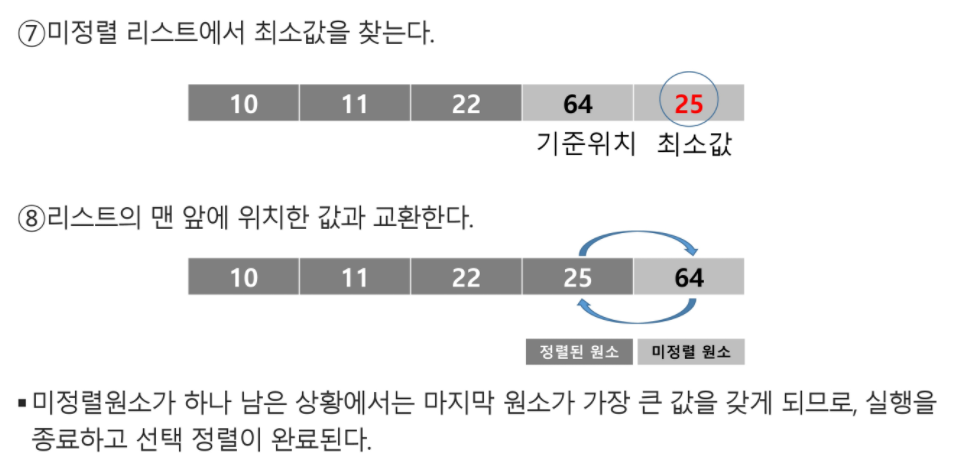

# 0214 라이브

## 배열 2: 2차원 배열

- 2차원 배열의 선언

  - 1차원 list를 묶어놓은 list

  - 2차원 이상의 다차원 list는 차원에 따라 Index를 선언

  - 2차원 list의 선언 : 세로길이(행의 개수), 가로길이(열의 개수)를 필요로 함

  - Python 에서는 데이터 초기화를 통해 변수선언과 초기화가 가능함

  - 

  - ```python
    N = int(input)
    arr = [list(map(int, input().split())) for _ in range(N)]
    ```

  - 

  - ```python
    N = int(input)
    arr = [list(map(int, input())) for _ in range(N)]
    ```

  - ```python
    arr1 = [0] + list(map(int, input().split())) + [0]
    # arr1 = [0, 1 ,2 ,3, 0]
    arr2 = [[0]*(N+2)] + [[0] + list(map(int, input().split()))  + [0] for _ in range(N)] + [[0]*(N+2)]
    # arr2 = [0, 0, 0, 0, 0], [0, 1, 2, 3, 0], [0, 4, 5, 6, 0], [0 ,7 ,8, 9, 0], [0, 0, 0, 0, 0]
    ```

  - 

- 배열 순회

  - n X m 배열의 n*m 개의 모든 원소를 빠짐없이 조사하는 방법

- 행 우선 순회 

  - ```python
    # i 행의 좌표
    # j 열의 좌표
    for i in range(n):
        for j in range(m):
            Array[i][j] # 필요한 연산 수행
    ```

- 

- 열 우선 순회 

  - ```python
    # i 행의 좌표
    # j 열의 좌표
    
    for j in range(m):
        for i in range(n):
            Array[i][j] # 필요한 연산 수행
    ```

- 지그재그 순회

  - ```python
    # i 행의 좌표
    # j 열의 좌표
    
    for i in range(n):
        for j in range(m):
            Array[i][j + (m-1-2*j) * (i%2)]
            # 필요한 연산 수행
    ```

- 델타를 이용한 2차 배열 탐색

  - 2차 배열의 한 좌표에서 4방향의 인접 배열 요소를 탐색하는 방법

  - ```pseudocode
    arr[0...N-1][0...N-1] # NxN 배열
    di[] <- [0, 0, -1 ,1] # 좌우상하
    dj[] <- [-1, 1, 0, 0]
    for i : 0 -> N-1
        for j : 0 -> N-1 :
                for k in range(4):
                    ni <- i + di[k]
                    nj <- j + dj[k]
                    if 0 <= ni <N and 0 <= nj < n # 유효한 인덱스면 test(arr[ni][nj])
    ```

  - ```python
    arr = [[1, 2, 3],[4, 5, 6],[7, 8, 9]]
    
    N = 3
    for i in range(N):
        for j in range(N):
            for di, dj in [(0,1), (1,0), (0,-1), (-1,0)]:
       			ni = i + di
        		nj = j + dj
        		if 0 <= ni < N and 0 <= nj < M: #유효 인덱스
            		print(i, j, arr[ni][nj])
     
    ```

- 전치 행렬 

  - ```python
    # i : 행의 좌표, len(arr)
    # j : 열의 좌표, len(arr[0])
    arr = [[1, 2, 3],[4, 5, 6],[7, 8, 9]] # 3*3 행렬
    
    for i in range(3):
        for j in range(3):
            if i < j :
                arr[i][j], arr[j][i] = arr[j],[i], arr[i],[j]
    ```

  - ```python
    arr = [[1, 2, 3],[4, 5, 6],[7, 8, 9]] # 3*3 행렬
    for i in range(3):
        print(*arr[i])
    
    print('='*30)
    
    for i in range(3):
        for j in range(i+1, 3):
            arr[i][j], arr[j][i] = arr[j],[i], arr[i],[j]
    for i in range(3):
        print(*arr[i])
    ```

## 부분집합생성

- 부분집합의 수 

  - 집합의 원소가 n개일 때, 공집합을 포함한 부분집합의 수는 2**n개

  - 각 원소가 부분집합에 포함되었는지를 loop 이용하여 확인하고 부분집합을 생성하는 방법

  - ```python
    bit = [0, 0, 0, 0]
    for i in range(2):
        bit[0] = i					# 0번째 원소
        for j in range(2):
            bit[1] = j				# 1번째 원소
            for k in range(2):
                bit[2] = k			# 2번째 원소
                for l in range(2):
                    bit[3] = l		# 3번째 원소
                    print_subset(bit)	# 생성된 부분집합 출력
    ```

  - ex)

  - ```python
    arr = [3, 6, 7, 1, 5, 4]
    
    n = len(arr)				# n : 원소의 개수
    
    for i in range(1<<n):		# 1<<n : 부분 집합의 개수
        for j in range(n):		# 원소의 수만큼 비트를 비교함
            for i & (1<<j):		# i의 j번 비트가 1인 경우
                print(arr[j], end=", ")		# j번 원소 출력
        print()
    print()
    ```

  - 

## 검색

- 저장되어 있는 자료 중에서 원하는 항목을 찾는 직업

- 목적하는 탐색 키를 가진 항목을 찾는 것

  - 탐색 키(search key): 자료를 구별하여 인식할 수 있는 키

- 검색의 종류

  - 순차 검색
  - 이진 검색
  - 해쉬

- ## 순차 검색

  - 일렬로 되어 있는 자료를 순서대로 검색하는 방법

    - 가장 간단하고 직관적인 검색 방법
    - 배열이나 연결 리스트 등 순차구조로 구현된 자료구조에서 원하는 항목을 찾을 때 유용함
    - 알고리즘이 단순하여 구현이 쉽지만, 검색 대상의 수가 많은 경우에는 수행시간이 급격히 증가하여 비효율적임

  - 2가지 경우

    - 정렬되어 있는 경우
    - 정렬되어 있지 않은 경우

  - #### 정렬되어 있지 않은 경우

  - 검색 과정

    - 첫번째 원소부터 순서대로 끝까지 키 값과 같은 원소 있는지 찾음
    - 키 값이 동일한 원소를 찾으면 인덱스 반환
    - 못 찾으면 검색 실패

  - 

  - 찾고자 하는 원소의 순서에 따라 비교회수가 결정됨

    - 첫 번째 원소를 찾을 때는 1번 비교, 두번째 원소를 찾을 때는 2번 비교..
    - 정렬되지 않는 자료에서의 순차 검색의 평균 비교 회수
      - = (1/n)*(1+2+3+....+n = (n+1)/2
    - 시간 복잡도 : O(n)

  - ```pseudocode
    def sequentialSearch(a, n, key)
    	i <- 0
        while i<n and a[i]!=key: # 인덱스 유효 검사
            i <- i+1
        if i<n: return i
        else: retrun -1
    ```

  - #### 정렬되어 있는 경우

  - 검색과정

    - 자료가 오름차순으로 정렬된 상태에서 검색을 실시한다고 가정
    - 자료를 순차적으로 검색하면서 키 값을 비교하여, 원소의 키 값이 검색 대상의 키 값보다 크면 찾는 원소가 없다는 것이므로 더 이상 검색하지 말고 종료

  - 

  - 

  - 찾고자 하는 원소의 순서에 따라 비교회수가 결정됨

    - 정렬이 되어있으므로 검색 실패를 반환하는 경우 평균 비교 회수가 반으로 줄어듦
    - 시간 복잡도 : O(n)

  - ```pseudocode
    def sequentialSearch2(a, n, key)
    	i <- 0
    	while i<n and a[i]<key :
    		i <- i+1
    	if i<n and a[i] == key :
    		return i
    	else:
    		return -1
    ```

- ## 이진 검색

  - 자료의 가운데에 있는 항목의 키 값과 비교하여 다음 검색의 위치를 결정하고 검색을 계속 진행하는 방법

    - 목적 키를 찾을 때까지 이진 검색을 순환적으로 반복 수행함으로써 검색 범위를 반으로 줄여가면서 보다 빠르게 검색을 수행함

  - 이진 검색을 위해서는 자료가 정렬된 상태여야 함

  - 검색과정

    - 자료의 중앙에 있는 원소를 고름
    - 중앙 원소의 값과 찾고자 하는 목표값을 비교
    - 목표 값이 중앙 원소의 값보다 작으면 자료의 왼쪽 반에 대해서 검색 수행, 크다면 오른쪽 반에 대해서 검색 수행
    - 찾고자 하는 값 찾을 때까지 반복

  - 

  - 

  - 구현

    - 검색 범위의 시작점과 종료점을 이용하여 검색을 반복 수행
    - 이진 검색의 경우, 자료에 삽입이나 삭제가 발생했을 때 배열의 상태를 항상 정렬 상태로 유지하는 추가 작업이 필요

  - ```python
    def binarySearch(a, N, key):
        start = 0
        end = N-1
        while start <= end :
            middle = (start + end)//2
            if a[middle] == key :		# 검색 성공
                return true
            elif a[middle] > key :
                end = middle - 1
            else :
                start = middle + 1
        return false					# 검색 실패
    ```

- 인덱스

  - 인덱스라는 용어는 DB에서 유래했으며 테이블에 대한 동작 속도를 높여주는 자료 구조를 일컫는다. DB 분야가 아닌 곳에서는 Look up table 등의 용어를 사용하기도 함
  - 인덱스를 저장하는데 필요한 디스크 공간은 보통 테이블을 저장하는데 필요한 디스크 공간보다 작음 왜냐면 보통 인덱스는 키-필드만 가지고 있고 테이블의 다른 세부 항목들은 갖고 있지 않기 때문

- 배열을 사용한 인덱스

  - 대량의 데이터를 매번 정렬하면 프로그램의 반응이 느려짐, 이러한 성능 저하 문제를 해결하기 위해 배열 인덱스를 사용할 수 있음

- ## 선택정렬

  - 주어진 자료들 중 가장 작은 값의 원소부터 차례대로 선택하여 위치를 교환하는 방식

  - 정렬 과정

    - 주어진 리스트 중에서 최소값을 찾는다
    - 그 값을 리스트의 맨 앞에 위치한 값과 교환
    - 맨 처음 위치를 제외한 나머지 리스트를 대상으로 위의 과정 반복

  - 시간복잡도 O(n**2)

  - 

  - 

  - 

  - 

  - ```pseudocode
    def SelectionSort(a[], n):
    	for i from 0 to n-2
    		a[i],....a[n-1] 원소 중 최소값 a[k] 찾음
    		a[i]와 a[k] 교환
    ```

  - ```python
    def SelectionSort(a, N) :
        for i in range(N-1) :
            minIdx = i
            for j in range(i+1, N):
                if a[minIdx] > a[j] :
                    minIdx = j
            a[i], a[minIdx] = a[minIdx], a[i]
    ```

- ## 셀렉션 알고리즘

  - 저장되어 있는 자료로부터 k번째로 큰 혹은 작은 원소를 찾는 방법을 셀렉션 알고리즘이라 한다.

    - 최소값, 최대값 혹은 중간값을 찾는 알고리즘을 의미하기도 함

  - 선택 과정

    - 셀렉션은 아래와 같은 과정을 통해 이루어짐
      - 정렬 알고리즘을 이용하여 자료 정렬
      - 원하는 순서에 있는 원소 가져오기

  - k 번째로 작은 원소를 찾는 알고리즘

    - 1번부터 k번째까지 작은 원소들을 찾아 배열의 앞쪽으로 이동시키고, 배열의 k번째를 반환한다.
    - k가 비교적 작을 때 유용하며 O(kn)의 수행시간을 필요로 함

  - ```pseudocode
    def select(arr, k) : 
    	for i in range(0, k) :
    		minIndex = i
    		for j in range (i+1, len(arr)) :
    			if arr[minIndex] > arr[j] :
    				minIndex = j
            arr[i], arr[minIndex] = arr[minIndex], arr[i]
        return arr[k-1]
    ```

  - 

## 선택정렬

