## 0216 라이브

## 문자열

- 문자열 뒤집기

  - 자기 문자열에서 뒤집는 방법  + 새로운 빈 문자열 만들어서 뒤에서부터 읽어서 타겟에 쓰는 방법
  - 자기 문자열을 이용할 경우 swap을 위한 임시 변수가 필요하며 반복 수행을 문자열 길이의 반만을 수행해야 함
  - 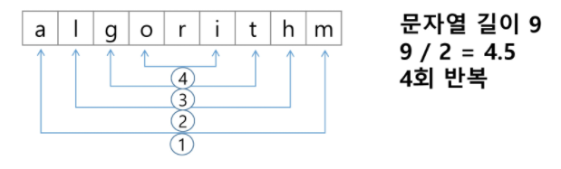

- 문자열 비교

  - 파이썬에서는 == 연산자와 is 연산자를 제공한다

- 문자열 숫자를 정수로 변환하기

  - 파이썬은 걍 하면 됨

  - ```python
    int('123'), float('3.14'), str(123), repr(123)
    ```

  - int()와 같은 atoi()함수 만들기 - 이거 슈도코드라 작동 제대로 안됨

  - ```python
    def atoi(s):
        i = 0
        for x in s:
            i = i*10 + ord(x)-ord('0')
        return i
    ```

## 패턴매칭

- 패턴 매칭에 사용되는 알고리즘들

  - 고지식한 패턴 검색 알고리즘
  - 카프 - 라빈 알고리즘
  - KMP 알고리즘
  - 보이어 - 무어 알고리즘

- ### 고지식한 알고리즘 (Brute Force)

  - 본문 문자열을 처음부터 끝까지 차례대로 순회하면서 패턴 내의 문자들을 일일이 비교하는 방식으로 동작

  - 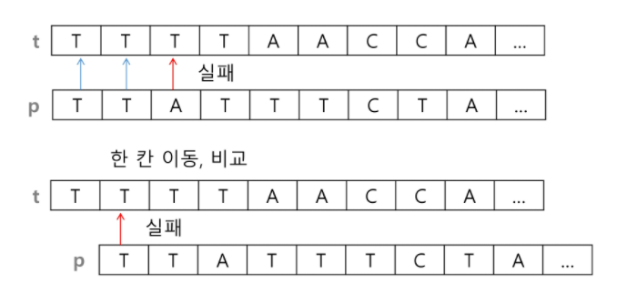

  - 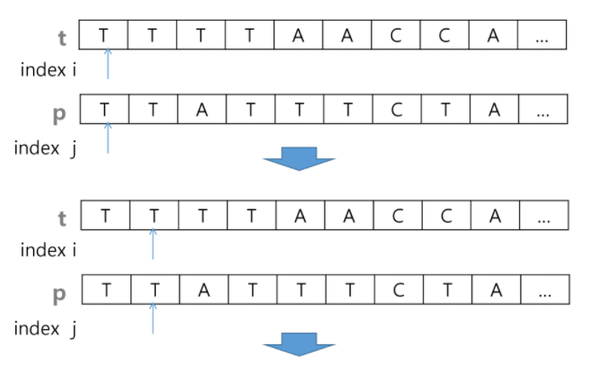

  - 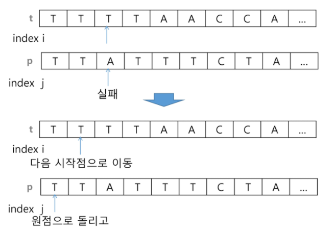

  - ```python
    p = 'is' # 찾을 패턴
    t = 'This is a book~!' # 전체 텍스트
    M = len(p) # 찾을 패턴의 길이
    N = len(t) # 전체 텍스트의 길이
    
    def BruteForce(p, t):
        i = 0 # t의 인덱스
        j = 0 # p의 인덱스
        while j < M and i < N:
            if t[i] != p[j]:
                i = i - j
                j = -1
            i = i + 1
            j = j + 1
        if j == M : return i - M # 검색 성공
        else : return -1 # 검색 실패
    ```

  - 최악의 경우 시간 복잡도는 텍스트의 모든 위치에서 패턴을 비교해야 하므로 O(MN)이 됨

- ### KMP 알고리즘

  - 불일치가 발생한 텍스트 스트링의 앞 부분에 어떤 문자가 있는지를 미리 알고 있으므로, 불일치가 발생한 앞 부분에 대하여 비교하지 않고 매칭을 수행

  - 패턴을 전처리하여 배열 next[M]을 구해서 잘못된 시작을 최소화함

    - next[M] : 불일치가 발생했을 경우 이동할 다음 위치

  - 시간복잡도 : O(M+N)

  - 아이디어 설명

    - 텍스트에서 abcdabc까지는 매치되고, e에서 실패한 상황
    - 패턴의 맨 앞의 abc와 실패 직전의 abc는 동일함을 이용할 수 있다
    - 실패한 텍스트 문자와 P[4]를 비교한다
    - 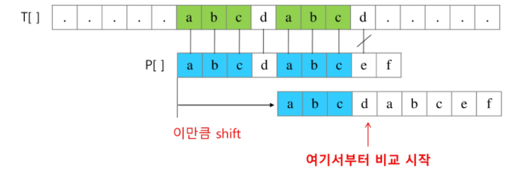
    - 매칭이 실패했을 때 돌아갈 곳을 계산한다
    - 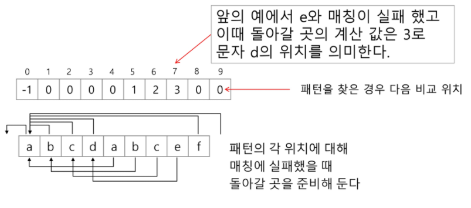

  - ```python
    def kmp(t, p):
        N = len(t)
        M = len(p)
        lps = [0] * (M + 1)
        # preprocessing
        j = 0 # 일치한 개수 == 비교할 패턴 위치
        lps[0] = -1
        for i in range(1, M):
            lps[i] = j
            if p[i] == p[j]:
                j += 1
            else:
                j = 0
        lps[M] = j
        # search
        i = 0 	# 비교할 텍스트 위치
        j = 0	# 비교할 패턴 위치
        while i < N and j <= M:
            if j == -1 or t[i] == p[j]:		# 첫 글자가 불일치 했거나, 일치하면
                i += 1
                j += 1
            else:					# 불일치
                j = lps[j]
            if j == M:				# 패턴을 찾을 경우
                print(i=M, end = ' ')	# 패턴의 인덱스 출력
                j = lps[j]
                
    ```

- ### 보이어 - 무어 알고리즘

  - 오른쪽에서 왼쪽으로 비교
  - 대부분의 상용 소프트웨어에서 채택
  - 패턴에 오른쪽 끝에 있는 문자가 불일치하고 이 문자가 패턴 내에 존재하지 않는 경우, 이동거리는 무려 패턴의 길이만큼이 됨
  - 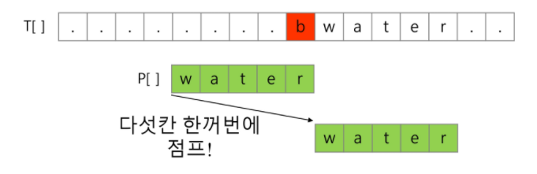
  - 오른쪽 끝에 있는 문자가 불일치하고 이 문자가 패턴내에 존재할 경우
  - 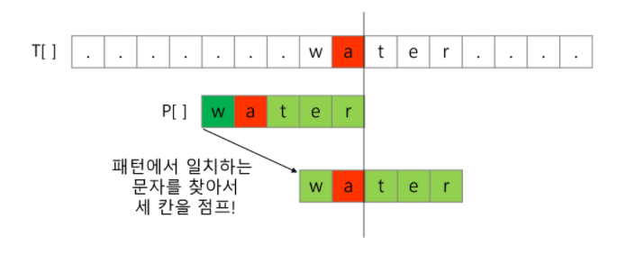
  - 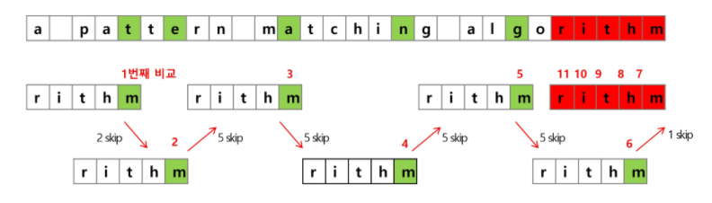
  - 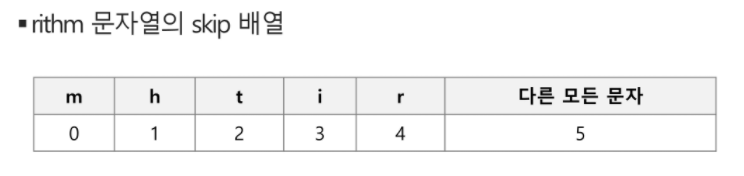

- ### 문자열 매칭 알고리즘 비교

  - 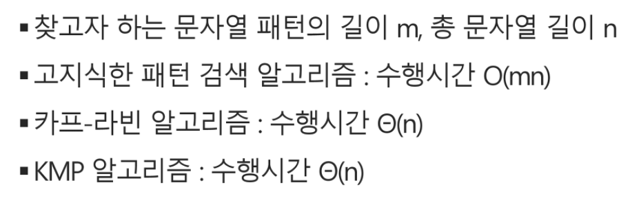
  - 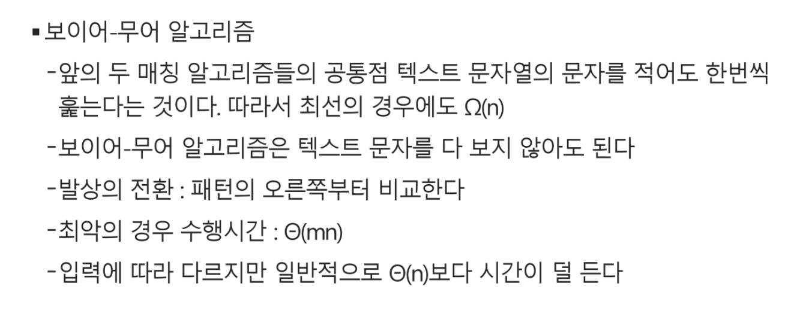

