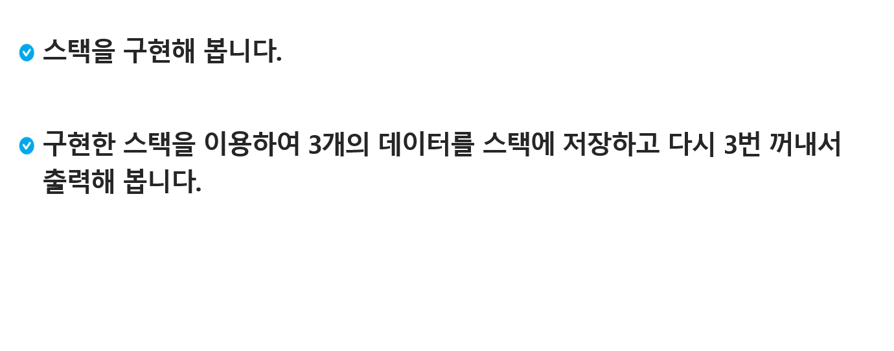
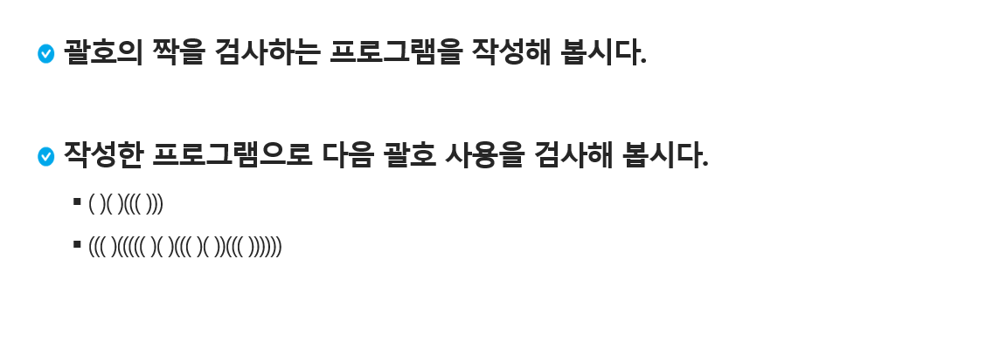
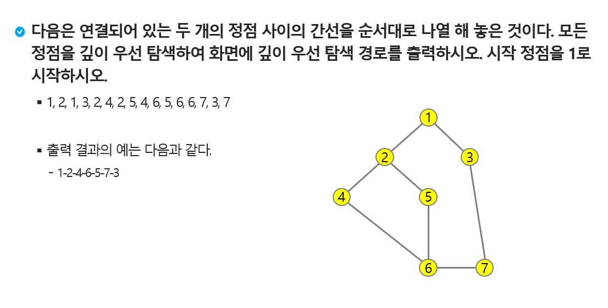

# Stack I


| Title               | Directory             | 비고 |
| ------------------- | --------------------- | ---- |
| 연습문제1           | `p1`                  | ppt  |
| 연습문제2           | `p2`                  | ppt  |
| 연습문제3           | `p3 `                 | ppt  |
| 2005_파스칼의삼각형 | `2005_파스칼의삼각형` | HW   |

### 연습문제 1 - 스택 구현하기




### 연습문제 2 - 괄호 검사



```bash
4
()()((()))
((()((((()()((()())((())))))
(())(((())()))(()()((()))
))))
```

```bash
#1 1
#2 -1
#3 -1
#4 -1
```


### 연습문제 3 DFS



```bash
7 8
1 2 1 3 2 4 2 5 4 6 5 6 6 7 3 7
```

```bash
1 2 4 6 5 7 3 
```


### [HomeWork.2005_파스칼의 삼각형](https://swexpertacademy.com/main/code/problem/problemDetail.do?contestProbId=AV5P0-h6Ak4DFAUq&categoryId=AV5P0-h6Ak4DFAUq&categoryType=CODE&problemTitle=2005&orderBy=FIRST_REG_DATETIME&selectCodeLang=ALL&select-1=&pageSize=10&pageIndex=1)
