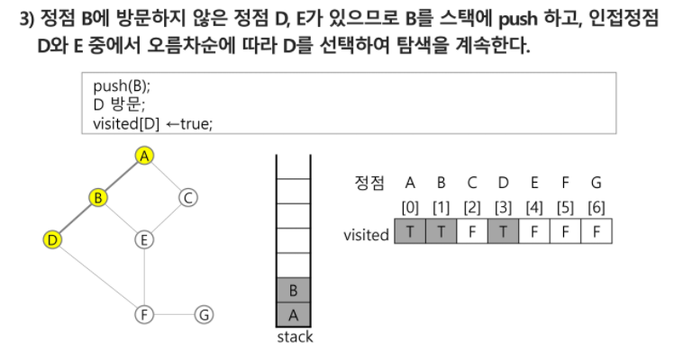
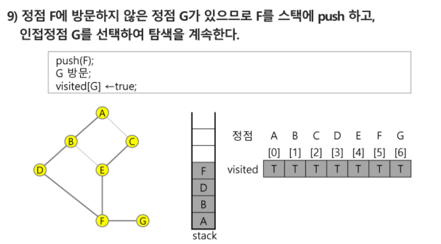
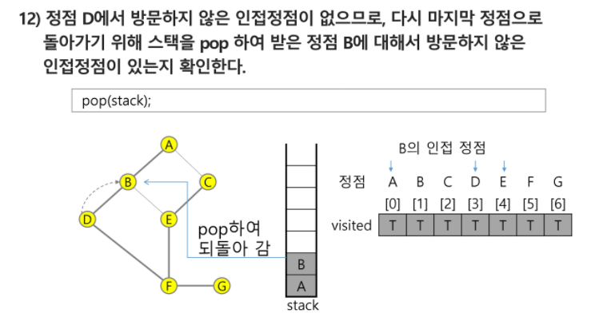
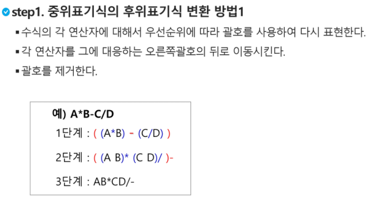
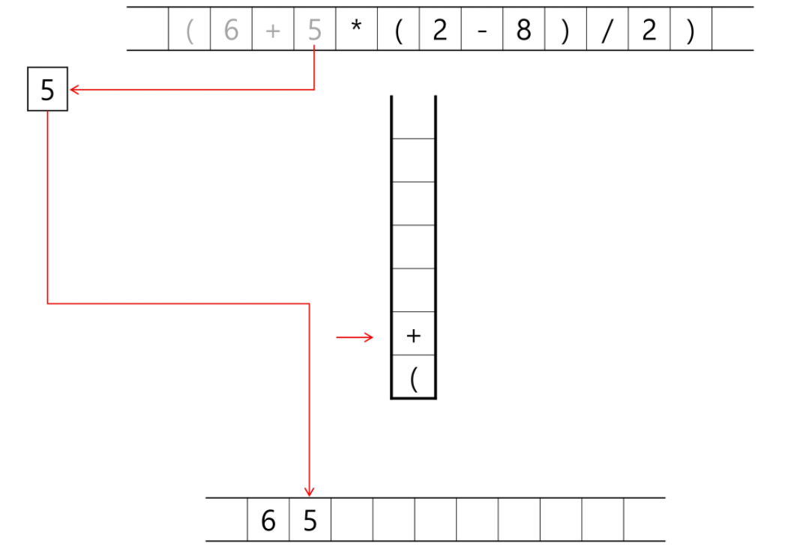
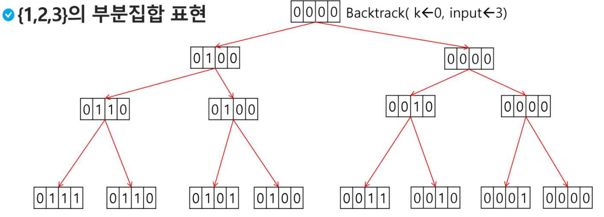

## 0223 라이브

- ### DFS (깊이 우선 탐색)	

  - 시작 정점의 한 방향으로 갈 수 있는 경로가 있는 곳까지 깊이 탐색해 가다가 더 이상 갈 곳이 없게 되면, 가장 마지막에 만났던 갈림길 간선이 있는 정점으로 되돌아와서 다른 방향의 정점으로 탐색을 계속 반복하여 결국 모든 정점을 방문하는 순회방법
  - 가장 마지막에 만났던 갈림길의 정점으로 되돌아가서 다시 깊이 우선 탐색을 반복해야 하므로 후입선출 구조의 스택 사용
  - DFS 알고리즘
    - 
    - 
  - DFS 예
    - 
    - 
    - 
    - 
    - 
    - 
    - 
    - 
    - 
    - 
    - 
    - 
    - 
    - 
    - 

- 계산기

  - 
  - 
  - 
  - 
  - 
  - 
  - 
  - 
  - 
  - 
  - 
  - 
  - 
  - 
  - 
  - 
  - 
  - 
  - 
  - 
  - 
  - 
  - 
  - 
  - 
  - 
  - 

- 백트래킹

  - 백트래킹 기법은 해를 찾는 도중에 막히면 되돌아가서 다시 해를 찾아가는 기법

  - 백트래킹 기법은 최적화 문제와 결정 문제를 해결할 수 있음

  - 결정문제 : 문제의 조건을 만족하는 해가 존재하는 지의 여부를 yes 또는 no로 답하는 문제

    - 미로 찾기
    - n - Queen 문제
    - Map coloring
    - 부분 집합의 합 문제 

  - 백트래킹 : 미로찾기

  - 

  - 

  - 

  - 

  - 백트래킹과 깊이 우선탐색과의 차이

    - 어떤 노드에서 출발하는 경로가 해결책으로 이어질 것 같지 않으면 더 이상 그 경로를 따라가지 않음으로써 시도의 횟수를 줄임
    - 깊이 우선탐색이 모든 경로를 추적하는데 비해 백트래킹은 불필요한 경로를 조기에 차단
    - 깊이우선탐색을 가하기에는 경우의 수가 너무 많음, 즉 N! 의 경우의 수를 가진 문제에 대해 깊이우선탐색을 가하면 처리 불가
    - 백트래킹 알고리즘을 적용하면 일반적으로 경우의 수가 줄어들지만 이 역시 최악의 경우에는 여전히 지수함수 시간을 요하므로 처리 불가

  - 모든 후보를 검사?

    - No!

  - 백트래킹 기법

    - 어떤 노드의 유망성을 점검한 후에 유망하지 않다고 결정되면 노드의 부모로 되돌아가 다음 자식 노드로 감

    - 어떤 노드를 방문하였을 때 그 노드를 포함한 경로가 해답이 될 수 없으면 그 노드는 유망하지 않다고 하며 반대로 해답의 가능성이 있으면 유망하다고 함
    - 가지치기(pruning) : 유망하지 않는 노드가 포함되는 경로는 더이상 고려하지 않음

  - 백트래킹을 이용한 알고리즘은 다음과 같은 절차로 진행됨

    1. 상태 공간 트리의 깊이 우선 검색을 실시
    2. 각 노드가 유망한지 점검
    3. 만일 그 노드가 유망하지 않다면 그 노드의 부모 노드로 돌아가서 검색을 계속함

  - 

  - 

  - 

  - 깊이 우선 검색 vs 백트래킹

    - 순수한 깊이 우선 검색 = 155노드
    - 백트래킹 = 27노드

  - 부분집합 구하기

    - 어떤 집합의 공집합과 자기자신을 포함한 모든 부분집합을 powerset이라고 하며 구하고자 하는 어떤 집합의 원소 개수가 n일 경우 부분집합의 개수는 2**n개이다.
    - 백트래킹 기법으로 powerset을 구해보자
      - 앞에서 설명한 일반적인 백트래킹 접근 방법을 이용한다
      - n개의 원소가 들어있는 집합의 2**n개의 부분집합을 만들 때에는 true 또는 false값을 가지는 항목들로 구성된 n개의 배열을 만드는 방법을 이용
      - 여기서 배열의 i번째 항목은 i번째의 원소가 부분집합의 값인지 아닌지를 나타내는 값임

  - 

  - 

  - 

  - 

  - 

  - 

  - 

  - 

  - 

  - 연습문제

    - {1,2,3,4,5,6,7,8,9,10}의 powerset중 원소의 합이 10인 부분집합을 구하시오
    - 
    - 
    - 
    - 

  - 순열

    - 
    - 
    - 

