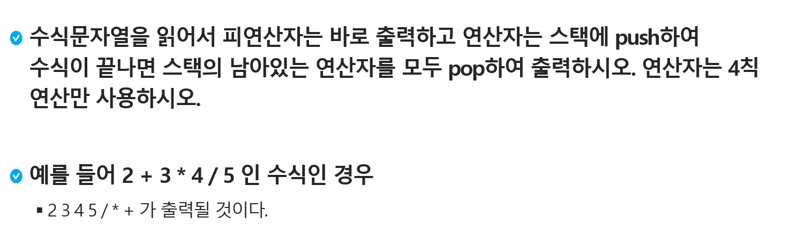
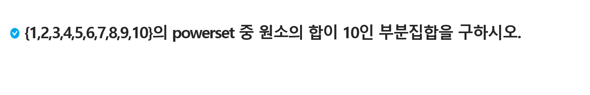

# Stack II


| Title        | Directory      | 비고 |
| ------------ | -------------- | ---- |
| 연습문제1    | `p1`           | ppt  |
| 연습문제2    | `p2`           | ppt  |
| 1223_계산기2 | `1223_계산기2` | HW   |
|              |                |      |

### 연습문제 1 - 후위 표기법



```
3
2+3*4/5
1*2/3+2
3-2*5+4/2-2
```

```
#1 2345/*+
#2 1232+/*
#3 325422-/+*-
```


### 연습문제 1 - extra

```
3
2+3*4/5
(6+5*(2-8)/2)
3-2*5+4/2-2
```

```
#1 234*5/+
#2 6528-*2/+
#3 325*-42/+2-
```


### 연습문제 2 - 부분집합



### [HomeWork.1223_계산기2](https://swexpertacademy.com/main/code/problem/problemDetail.do?contestProbId=AV14nnAaAFACFAYD&categoryId=AV14nnAaAFACFAYD&categoryType=CODE&problemTitle=1223&orderBy=FIRST_REG_DATETIME&selectCodeLang=ALL&select-1=&pageSize=10&pageIndex=1)


