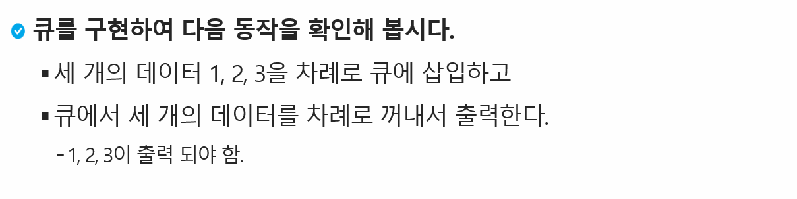
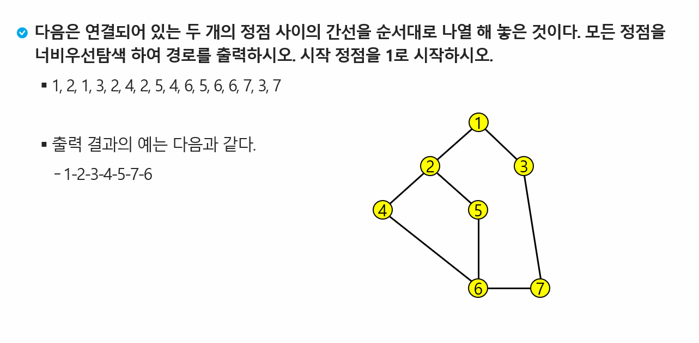

# Queue


| Title           | Directory         | 비고 |
| --------------- | ----------------- | ---- |
| 연습문제1       | `p1`              | ppt  |
| 연습문제2       | `p2`              | ppt  |
| 1225_암호생성기 | `1225_암호생성기` | HW   |
|                 |                   |      |

### 연습문제 1 - Q 구현




### 연습문제 2 - BFS 구현



```
7 8
1 2 1 3 2 4 2 5 4 6 5 6 6 7 3 7
```

### [HomeWork.1225 암호 생성기](https://swexpertacademy.com/main/code/problem/problemDetail.do?contestProbId=AV14uWl6AF0CFAYD&categoryId=AV14uWl6AF0CFAYD&categoryType=CODE&problemTitle=1225&orderBy=FIRST_REG_DATETIME&selectCodeLang=ALL&select-1=&pageSize=10&pageIndex=1)


