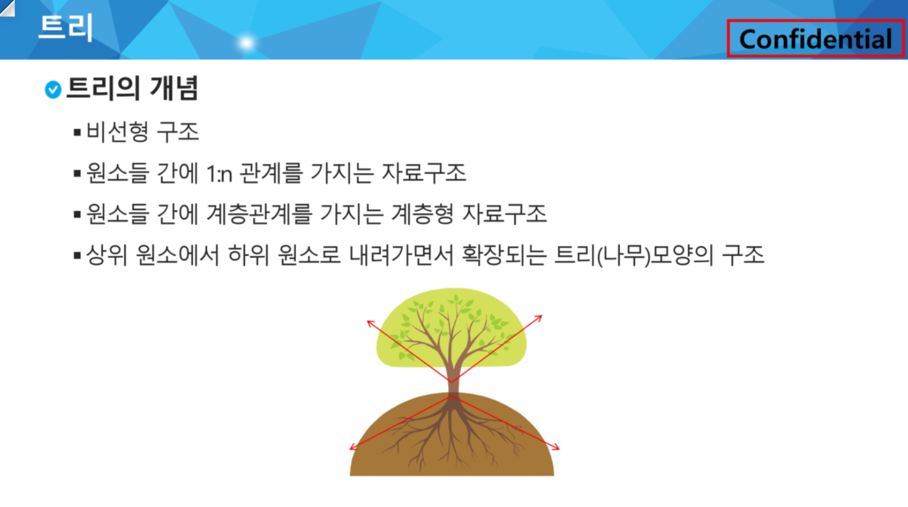
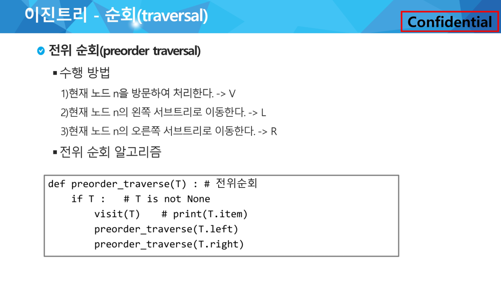
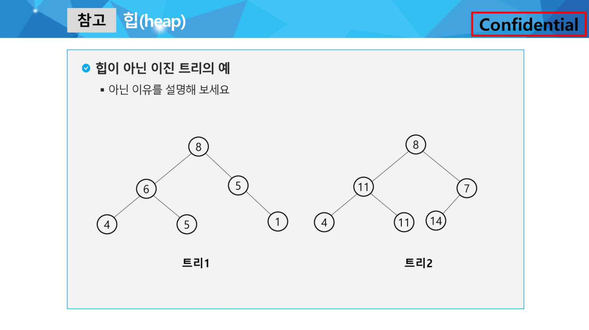
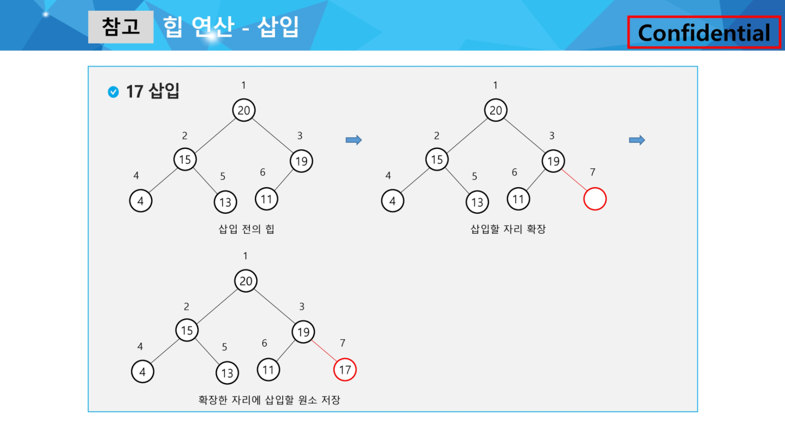

## 0316 라이브







```python
import sys; sys.stdin = open('input.txt')

def preorder(node):
    # 해당 노드가 있으면
    if node:
        print(f'{node}', end=' ')

        # 해당 노드의 왼쪽 조사
        preorder(tree[node][0])
        
        # 해당 노드의 오른쪽 조사
        preorder(tree[node][1])

def inorder(node):
    # 해당 노드가 있으면
    if node:

        # 해당 노드의 왼쪽 조사
        inorder(tree[node][0])
        
        print(f'{node}', end=' ')
        
        # 해당 노드의 오른쪽 조사
        inorder(tree[node][1])

def postorder(node):
    # 해당 노드가 있으면
    if node:

        # 해당 노드의 왼쪽 조사
        postorder(tree[node][0])
        
        # 해당 노드의 오른쪽 조사
        postorder(tree[node][1])

        print(f'{node}', end=' ')


# 각 노드의 수
V = int(input())

# 간선의 수
E = V - 1

# 간선 정보
arr = list(map(int, input().split()))

'''

1번 노드
 - 왼쪽 : 2번
 - 오른쪽 : 3번
 - 부모 : 없음

2번 노드
 - 왼쪽 : 4번
 - 오른쪽 : 3번
 - 부모 : 1번

3번노드
 - 왼쪽 : 5번
 - 오른쪽 : 6번
 - 부모 : 1번 

'''

tree = [[0,0,0] for _ in range(V + 1)]

# 간선의 개수만큼 반복해서
for i in range(E):
    parent, child = arr[i*2], arr[i*2+1]
    print(parent, child)

    # parent가 부모일때 왼쪽, 오른쪽 자식

    # 아직 왼쪽 자식이 없다면
    if tree[parent][0] == 0:
        tree[parent][0] = child
    else:
        tree[parent][1] = child
    # 자식 노드에 부모 값 추가
    tree[child][2] = parent
    print(tree)


print('-'*30)
print(tree[1])
print(f'1번째 노드의 왼쪽 자식 : {tree[1][0]}')
print(f'1번째 노드의 오른쪽 자식 : {tree[1][1]}')

print('-'*30)
print('전위순회')
# 시작할 노드 번호
preorder(1)
print()
print('-'*30)

print('-'*30)
print('중위순회')
# 시작할 노드 번호
inorder(1)
print()
print('-'*30)

print('-'*30)
print('후위순회')
# 시작할 노드 번호
postorder(1)
print()
print('-'*30)

```







