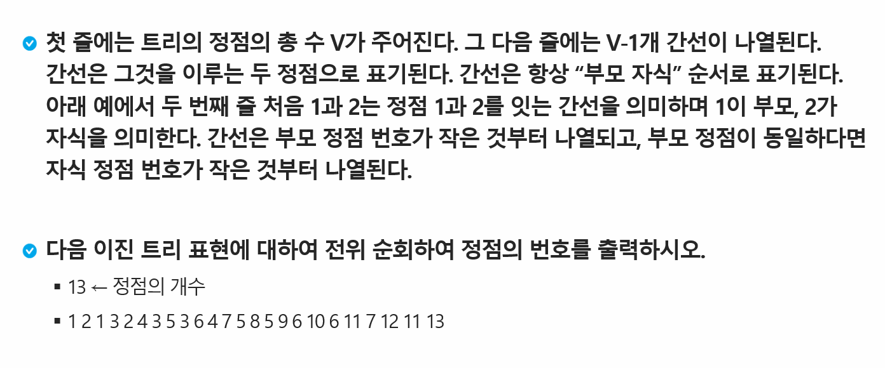
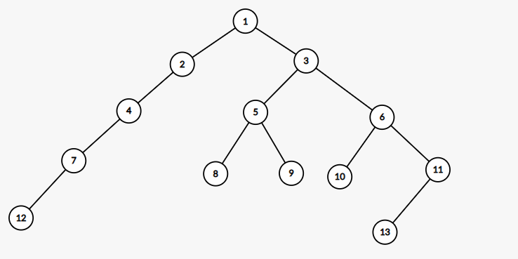

# Tree


| Title         | Directory       | 비고 |
| ------------- | --------------- | ---- |
| 연습문제1     | `p1`            | ppt  |
| 1231_중위순회 | `1231_중위순회` | HW   |

### 연습문제 1 - 순회





### input

```
13
1 2 1 3 2 4 3 5 3 6 4 7 5 8 5 9 6 10 6 11 7 12 11 13
```

### output

```
1 2 4 7 12 3 5 8 9 6 10 11 13
```


### [HomeWork.1231 중위순회](https://swexpertacademy.com/main/code/problem/problemDetail.do?contestProbId=AV140YnqAIECFAYD&categoryId=AV140YnqAIECFAYD&categoryType=CODE&problemTitle=1231&orderBy=FIRST_REG_DATETIME&selectCodeLang=ALL&select-1=&pageSize=10&pageIndex=1)

### +extra

- 1238 Contact

- 1861 정사각형 방

- 1486 장훈이의 높은 선반

- 5688 세제곱근을 찾아라

- 1232 사칙연산

- 1953 [모의 SW 역량테스트] 탈주범 검거

- 4012 [모의 SW 역량테스트] 요리사

  
