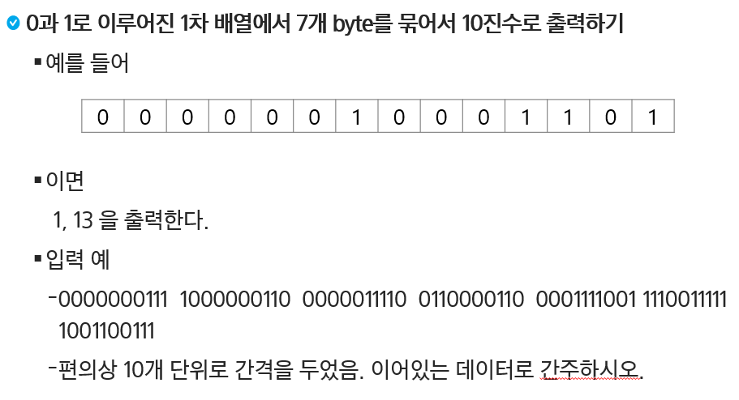
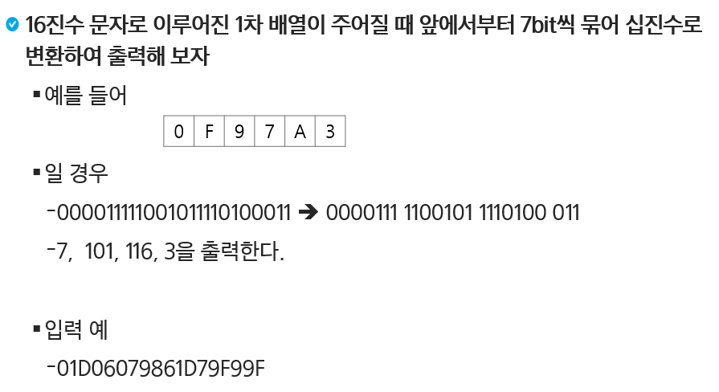
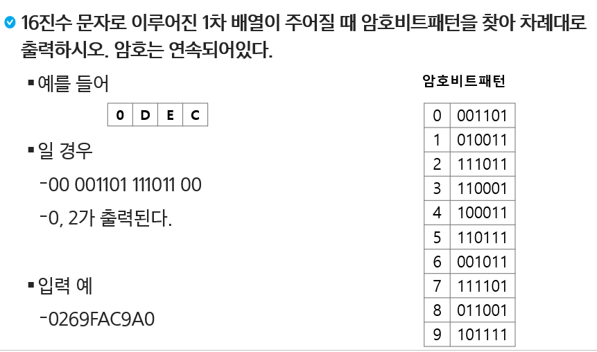

# 비트연산자


| Title                | Directory              | 비고 |
| -------------------- | ---------------------- | ---- |
| 연습문제1            | `p1`                   | ppt  |
| 연습문제2            | `p2`                   | ppt  |
| 연습문제3            | `p3`                   | ppt  |
| 1240_단순2진암호코드 | `1240_단순2진암호코드` | HW   |

### 연습문제 1



```sh
# input
2
00000010001101
0000000111100000011000000111100110000110000111100111100111111001100111
```

```sh
# output
1 13
0 120 12 7 76 24 60 121 124 103
```


### 연습문제 2



```sh
# input
2
0F97A3
01D06079861D79F99F
```

```sh
# output
7 101 116 3
0 116 12 7 76 24 58 121 124 103 3
```


### 연습문제 3



```sh
# input
2
0DEC
0269FAC9A0
```

```sh
# output
0 2
1 1 7 8 0
```


### [HomeWork.1240_단순2진암호코드](https://swexpertacademy.com/main/code/problem/problemDetail.do?contestProbId=AV15FZuqAL4CFAYD&categoryId=AV15FZuqAL4CFAYD&categoryType=CODE&problemTitle=1240&orderBy=FIRST_REG_DATETIME&selectCodeLang=ALL&select-1=&pageSize=10&pageIndex=1)


### +extra

- `2819_격자판의_숫자_이어_붙이기`
- `1952_[모의_SW_역량테스트]_수영장`
- `2105_[모의_SW_역량테스트]_디저트_카페`
- `4366_정식이의_은행업무`

- `4615_재미있는_오셀로_게임`

- `2117_[모의_SW_역량테스트]_홈_방범_서비스`
- `2382_[모의_SW_역량테스트]_미생물_격리`
