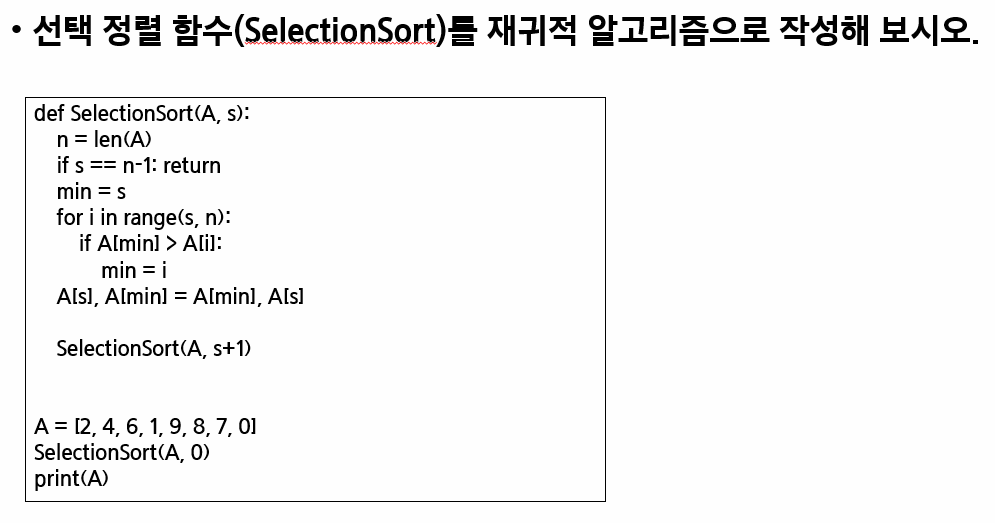
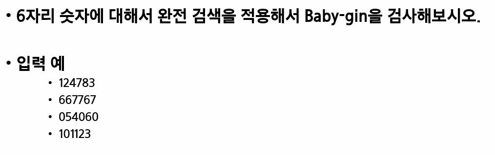

# 완전검색/그리디


| Title       | Directory       | 비고 |
| ----------- | --------------- | ---- |
| 연습문제1   | `p1`            | ppt  |
| 연습문제2   | `p2`            | ppt  |
| 5188_최소합 | `5188_최소합`   | HW   |

### 연습문제 1




### 연습문제 2



```sh
# input
4
124783
667767
054060
101123
```

```sh
# output
False
True
True
False
```


### [HomeWork.5188_최소합](https://swexpertacademy.com/main/learn/course/lectureProblemViewer.do)

### **Extra**

- `1244_최대상금`
