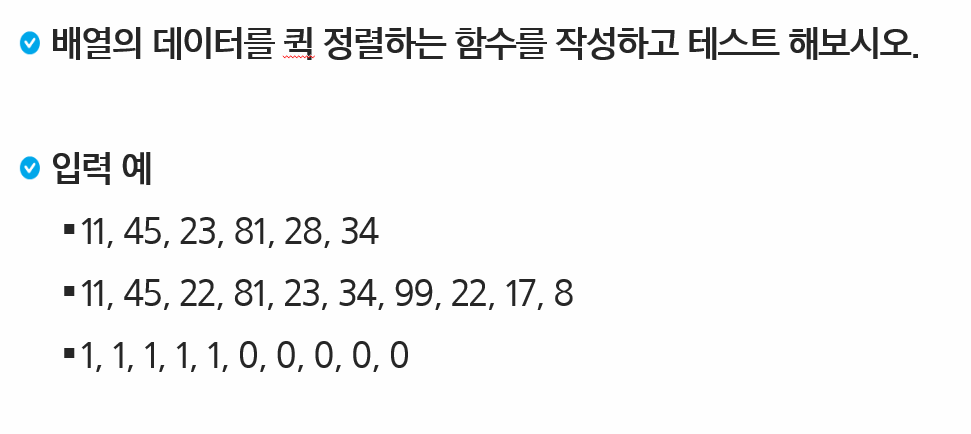
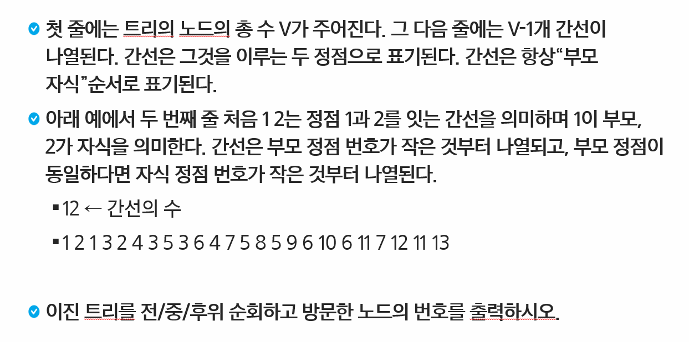

# 분할정복/백트래킹


| Title         | Directory       | 비고  |
| ------------- | --------------- | ----- |
| 연습문제1     | `p1`            | ppt   |
| 연습문제3     | `p3`            | ppt   |
| 5204_병합정렬 | `5204_병합정렬` | learn |

### 연습문제 1




```sh
# input
3
11 45 23 81 28 34
11 45 22 81 23 34 99 22 17 8
1 1 1 1 1 0 0 0 0 0
```

```sh
# output
11 23 28 34 45 81
8 11 17 22 22 23 34 45 81 99
0 0 0 0 0 1 1 1 1 1
```


### 연습문제 3



```sh
# input
13 12
1 2 1 3 2 4 3 5 3 6 4 7 5 8 5 9 6 10 6 11 7 12 11 13
```

```sh
# output
전위 순회 : 1 2 4 7 12 3 5 8 9 6 10 11 13
중위 순회 : 12 7 4 2 1 8 5 9 3 10 6 13 11
후위 순회 : 12 7 4 2 8 9 5 10 13 11 6 3 1
```


### [HomeWork.5204_병합정렬](https://swexpertacademy.com/main/learn/course/subjectDetail.do?courseId=AVuPDYSqAAbw5UW6&subjectId=AWUYFsQq11kDFAVT)


