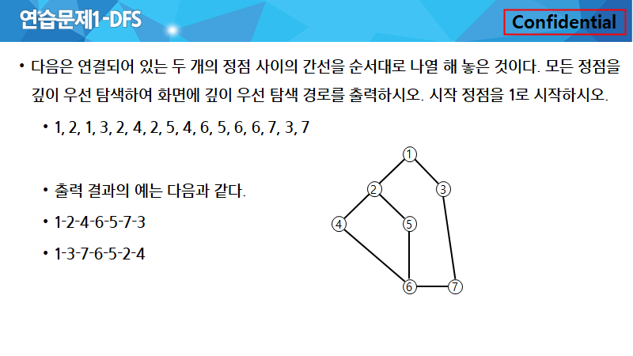
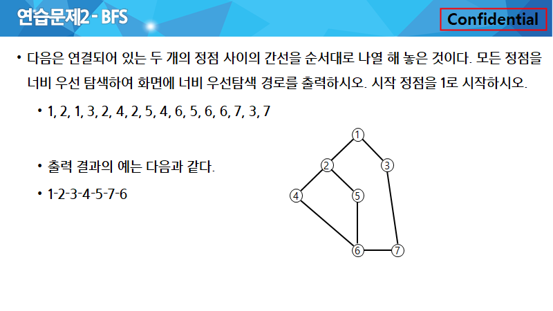

# 그래프


| Title         | Directory       | 비고  |
| ------------- | --------------- | ----- |
| 연습문제1     | `p1`            | ppt   |
| 연습문제2     | `p2`            | ppt   |
| 5247_연산     | `5247_연산`     | learn |

### 연습문제 1




```sh
# input
1 2 1 3 2 4 2 5 4 6 5 6 6 7 3 7
```

```sh
# output
1 2 4 6 5 7 3
# or
1 3 7 6 5 2 4
```


### 연습문제 2



```sh
# output
1 2 1 3 2 4 2 5 4 6 5 6 6 7 3 7
```
```sh
1 2 3 4 5 7 6
```


### [HomeWork.5247_연산](https://swexpertacademy.com/main/learn/course/subjectDetail.do?courseId=AVuPDYSqAAbw5UW6&subjectId=AWUYG3y62EcDFAVT&&)